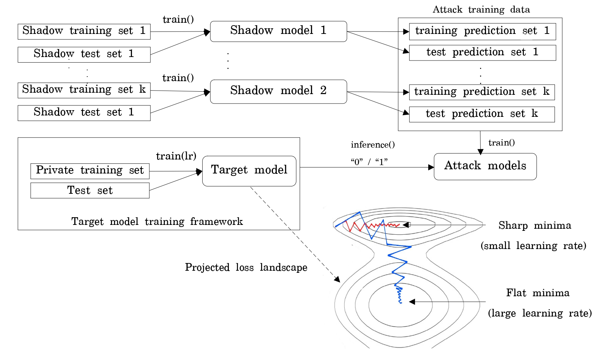
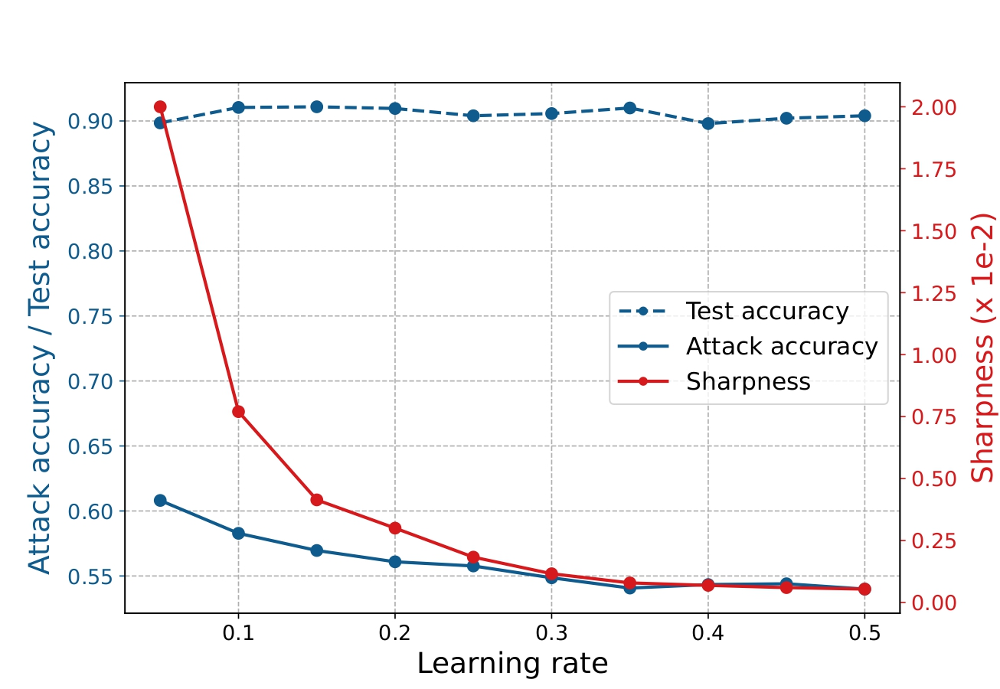

# Membership Inference Attack: Optimizing Region of Convergence to Preserve Model Privacy

## Abstract

Machine learning models often memorize training data, making them vulnerable to **membership inference attacks (MIA)** that can reveal whether specific records were used in training. This research investigates how the **geometry of the loss landscape**—specifically, whether the converged minima is flat or sharp—affects a model's privacy.

**Key Finding:** Models trained with large learning rates converge to flat regions in the loss landscape, which are significantly more resistant to membership inference attacks while maintaining or improving test accuracy.

We validate our approach on three model architectures (ResNet18, VGG-11, MLP) using FashionMNIST and CIFAR10 datasets. Results show that **large learning rates can reduce MIA attack success by 2-4%** while preserving model accuracy.

---

## Motivation

Membership inference attacks exploit the difference between a model's predictions on training data versus test data. While improving generalization is known to help defend against MIA, the specific role of the **loss landscape geometry** has not been thoroughly explored.

Recent work shows that the shape of the minima where SGD converges influences model generalization:
- **Large learning rates** → optimizer finds **flat minima** (wide, stable regions)
- **Small learning rates** → optimizer finds **sharp minima** (narrow, unstable regions)

This work hypothesizes that **flat minima preserve privacy better** because they rely less on memorized training data and more on learned generalizable features.

---

## Core Research Idea

### Loss Landscape and Privacy Connection


When a model converges to a flat region (large learning rate):
- Parameters are robust to small perturbations
- The model exhibits better generalization
- Membership inference becomes harder because training and test predictions are more similar

When a model converges to a sharp region (small learning rate):
- Parameters are sensitive to small changes
- The model overfits more easily
- Membership inference succeeds because training data produces distinctly different predictions

### Measuring Flatness: ε-Sharpness

We quantify how flat a minima is using the **ε-sharpness metric**:

```
sharpness = max_{w' ∈ B_ε(w)} [L(w') - L(w)] / [L(w) + 1]
```

This formula measures the maximum loss increase in a small ball around the learned weights. **Lower values = flatter minima = better privacy.**

---

## Experimental Framework

### Attack Pipeline

```
Shadow Models          Target Model           Attack Models
    ↓                      ↓                        ↓
Train k shadow    →   Train target model  →   Train binary classifiers
models on data     with varying learning    to distinguish training vs
subsets            rates (0.001 to 0.5)     test data based on model
                                             predictions
```

### Methodology

1. **Target Model Training:** Train ResNet18, VGG-11, or MLP with different learning rates
2. **Sharpness Estimation:** Calculate ε-sharpness at convergence
3. **Shadow Models:** Train 3 shadow models to generate attack training data
4. **Attack Models:** Train binary classifiers (one per class) to predict membership status
5. **Evaluation:** Measure test accuracy, attack accuracy, and loss landscape sharpness

### Datasets

| Dataset | Size | Images | Resolution |
|---------|------|--------|------------|
| FashionMNIST | 70,000 | 10 classes | 28×28 |
| CIFAR10 | 60,000 | 10 classes | 32×32×3 |

---

## Key Results

### FashionMNIST Results



| Learning Rate | Test Accuracy | Attack Accuracy | ε-Sharpness |
|---|---|---|---|
| 0.001 | 86.77% | 54.03% | 0.56 |
| 0.005 | 87.68% | 60.73% | 0.46 |
| 0.01 | 88.53% | 61.30% | 0.21 |
| 0.05 | 89.85% | 60.81% | 0.02 |
| 0.1 | 90.46% | 57.99% | <0.01 |
| **0.5** | **89.15%** | **53.99%** | **<0.01** |

**Interpretation:** 
- Learning rate 0.5 reduces MIA success to 53.99% (only slightly better than random guessing)
- Sharpness drops from 0.56 to <0.01, confirming convergence to much flatter regions
- Test accuracy remains high (89.15%), showing no accuracy loss

### CIFAR10 Results

| Learning Rate | Test Accuracy | Attack Accuracy | ε-Sharpness |
|---|---|---|---|
| 0.001 | 51.47% | 74.42% | 0.91 |
| 0.005 | 55.20% | 79.80% | 0.46 |
| 0.01 | 57.17% | 79.39% | 0.19 |
| 0.05 | 65.11% | 78.00% | 0.01 |
| 0.1 | 65.18% | 75.20% | <0.01 |
| **0.5** | **54.26%** | **72.80%** | **<0.01** |

**Interpretation:**
- Even with lower test accuracy on CIFAR10, large learning rate (0.5) still provides privacy benefit
- Attack accuracy drops from 79.39% (LR=0.01) to 72.80% (LR=0.5)
- Demonstrates that **privacy and accuracy both improve with large learning rates on well-conditioned datasets**

### Architecture Comparison

Different architectures show different sensitivities:
- **ResNet18:** Shows clearest trend; large LR significantly improves privacy
- **VGG-11:** Shows privacy improvement but less pronounced
- **MLP:** Shows minimal variation due to limited capacity

---

## How to Run Experiments

### Requirements

- Python 3.8+
- PyTorch 1.13.1+
- Dependencies listed in `requirements.txt`

### Installation

```bash
pip install -r requirements.txt
```

### Basic Usage

Run a single experiment with custom learning rate:

```bash
cd src/images/cifar
python3 main.py \
  --dataset CIFAR10 \
  --target_model resnet18 \
  --target_size 10000 \
  --target_lr 0.1 \
  --target_epoch 150
```

### Parameters

- `--dataset`: Dataset name (`CIFAR10`, `FashionMNIST`)
- `--target_model`: Model architecture (e.g., `resnet18`, `vgg11`, `vgg11_bn`)
- `--target_size`: Size of training set for target model
- `--target_lr`: Learning rate for target model (0.001 to 0.5)
- `--target_epoch`: Maximum training epochs (default: 150)

### Reproduce Learning Rate Sweep

To reproduce Figure 4 from the paper (learning rate sweep on FashionMNIST with ResNet18):

```bash
cd src/images/cifar
for lr in 0.05 0.1 0.15 0.2 0.25 0.3 0.35 0.4 0.45 0.5; do
  python3 main.py \
    --dataset FashionMNIST \
    --target_model resnet18 \
    --target_size 10000 \
    --target_lr $lr \
    --target_epoch 150
done
```

### Expected Runtime

- FashionMNIST: ~10-15 minutes per experiment (single GPU)
- CIFAR10: ~20-30 minutes per experiment (single GPU)
- Full sweep (10 learning rates): ~2-3 hours

---

## Key Insights

1. **Large learning rates act as an implicit privacy mechanism** by guiding optimizers to flatter loss landscape regions

2. **Privacy-utility trade-off is favorable:** On FashionMNIST, we gain privacy (2-4% reduction in attack success) while maintaining or improving accuracy

3. **Architecture matters:** Different model architectures show different sensitivities to learning rate changes

4. **Generalization and privacy are linked:** Models with better generalization (flatter minima) are naturally more resistant to membership inference

5. **Simple and practical:** This defense requires no additional modifications to training—just using a larger learning rate

---

## Related Work

This research connects three areas:

- **Membership Inference Attacks:** Shokri et al. (2016)
- **Loss Landscape Geometry:** Hochreiter & Schmidhuber (1997), Keskar et al. (2016)
- **Model Generalization:** Chaudhari et al. (2016), Jastrzebski et al. (2017)

---

## Citation

If you use this code or findings in your research, please cite:

```bibtex
@paper{nguyen2023mia,
  title={Optimizing Region of Convergence to Preserve Model Privacy from Membership Inference Attack},
  authors={Nguyen, Bao Dung and Pham, Tuan Dung and Ta, Viet Cuong},
  institution={HMI Lab, VNU University of Engineering and Technology},
  year={2023}
}
```

---

## Authors

**Bao Dung Nguyen**, **Tuan Dung Pham**, **Viet Cuong Ta** ✝

HMI Lab, VNU University of Engineering and Technology, Hanoi, Vietnam

✝ Corresponding Author

---

## Funding

This material is based upon work supported by the Air Force Office of Scientific Research under award number **FA2386-22-1-4026**.

We are grateful to Le Thanh Ha, Ngo Thi Duyen, Tran Quoc Long, and Hoang Thi Linh for valuable discussions and feedback.